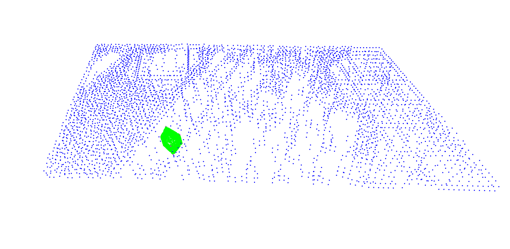

# Visibility Encoder
Train and predict visibility for camera parameters within urban contexts.

# Usage 

1. Clone reposityory, create and activate __conda environment__:

```
git clone git@github.com:StefanCobeli/Visibility_Encoder.git && cd Visibility_Encoder
conda env create -f environment.yml
conda activate visibility_encoder
```

2. Run `server.py`

```
python server.py
```

### 3. Use cases:

1. __Test current location__: 

Test model on a single given location 
    
Example:
- On broser:

    `http://127.0.0.1:5000/test_encoder_on_current_position`
- On command line:

  `curl -X POST -H "Content-Type: application/json" --data @./utils/assets/test_data/locations_example_single.json "http://127.0.0.1:5000/test_encoder_on_current_position"`
    

2. __Facade Generation__: `predict_facade_from_base_points_page` method predicts visibility values for the facade of a buildilg given by 4 base points.

Example:

- test in browser using:

`http://127.0.0.1:5000/predict_facade_from_base_points?bh=50&ppf=250`

- or in command line:

`curl -X POST -H "Content-Type: application/json" --data @./utils/assets/new_buildings/base_points_example.json "http://127.0.0.1:5000/predict_facade_from_base_points?bh=10&ppf=150"`

`base_points_example.json` files need to be located in `/utils/assets/new_buildings/`

3. __Test Encoder__: `test_encoder_on_data_page`tests and predicts visibility values from a locations csv file.

Example:
- test in browser using:

`http://127.0.0.1:5000/test_encoder_on_data`

- or in command line:

`curl -X POST -H "Content-Type: application/json" --data @./utils/assets/test_data/locations_example.json http://127.0.0.1:5000/test_encoder_on_data`
   
`locations_example.json` files need to be located in `/utils/assets/test_data/`


# Output format

All the methods use the following output format, namely a list of the genereated locations. 

__Each location__ is represented by:

1. `camera_coordinates` - The ordere is x, y, z, xh, yh, zh - __xyz__ are the coordinates and __xhyhzh__ are the roatations of the camera.

2. `predictions` - Values between 0 and 1 correspondet to the visibility values towards the selected classes _['building' ' water' ' tree' ' sky']_. 

```
[
  {
    "camera_coordinates": [
      842.5106601410772,
      45.02010124456787,
      1458.2977995297426,
      32.2071524443495,
      83.45431161148385,
      -32.04065846001832
    ],
    "predictions": [
      0.987492561340332,
      0.1578688621520996,
      0.8025062680244446,
      0.6580542922019958
    ]
  },
  {
    "camera_coordinates": [
...
]
```

# Intuitions

`predict_facade_from_base_points` accepts two link parameters: 

- `bh` buiding height (Example: bh=5)
- `ppf` points per facade side (Example: ppf=10)
- `bpn` base points name - name to be appended on the resulting predicitons file (Example: bpn=Willis, defualt is "unnamed_building")

To generate a __building of height 75__ and with __1,000 locations per facade side__ the following link can be used:


    http://127.0.0.1:5000/predict_facade_from_base_points?bh=75&ppf=1000

- or in command line:
- 

`curl -X POST -H "Content-Type: application/json" --data @./utils/assets/new_buildings/base_points_example.json "http://127.0.0.1:5000/predict_facade_from_base_points?bh=75&ppf=1000&bpn=Willis"`

(in total there will be 5 * 1,000 * 6 predictions, 5 faces of the building and 6 camera angles per location).

    Obs: Each buildig has 5 faces because we generate four walls and one rooftop. No points are generated on the ground level.


New building from base points:


